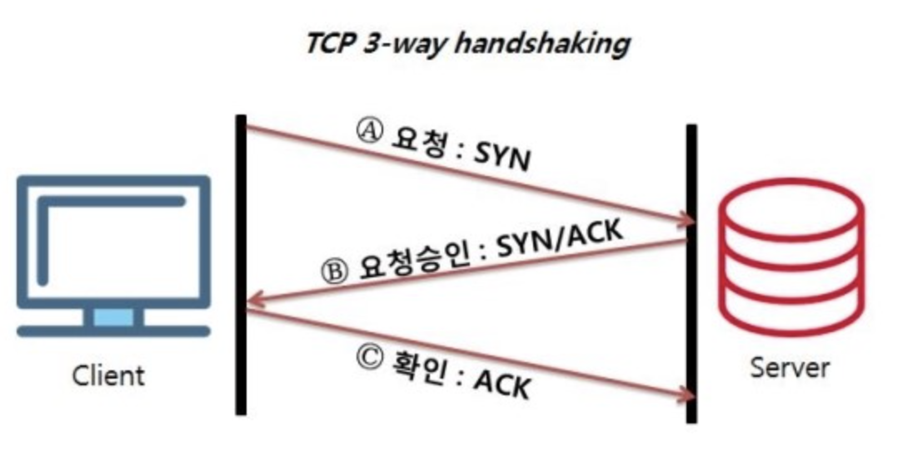
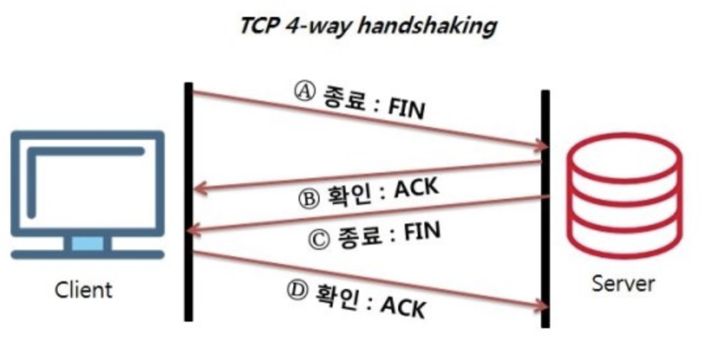

## TCP의 연결 설정 과정과 연결 종료 과정 단계가 차이나는 이유가 무엇인가요?

### TCP의 연결 과정(3-way handshaking)

1. A -> B : SYN
접속 요청 프로세스 A가 연결 요청 메시지 전송
2. B -> A : SYN + ACK
접속 요청을 받은 프로세스 B가 요청을 수락했으며, 접속 요청 프로세스인 A도 포트를 열어달라는 메시지 전송
3. A -> B : ACK
마지막으로 접속 요청 프로세스 A가 수락 확인을 보내 연결을 맺음

### TCP의 연결 종료

1. A -> B : FIN
프로세스 A가 연결을 종료하겠다는 FIN 플래그 전송
2. B -> A : ACK
프로세스 B는 일단 확인 메세지를 보내고 자신의 통신이 끝날 때 까지 기다림
3. B -> A : FIN
프로세스 B가 통신이 끝났으면 연결 종료 요청에 합의한다는 의미로 프로세스 A에게 FIN 프래그를 전송
4. A -> B : ACK
프로세스 A가 확인했다는 메세지 전송

### 단계가 차이나는 이유

client가 데이터 전송을 마쳤다고 하더라도 server는 아직 보낼 데이터가 남아있을 수 있기 때문에 일단 FIN에 대한 ACK만 보내고, 데이터를 모두 전송한 후에 자신도 FIN 메세지를 보내기 때문입니다.

출처
https://velog.io/@ragnarok_code/Network-TCP-%ED%94%84%EB%A1%9C%ED%86%A0%EC%BD%9C-%EC%97%B0%EA%B2%B0%EC%A2%85%EB%A3%8C-%EA%B3%BC%EC%A0%95