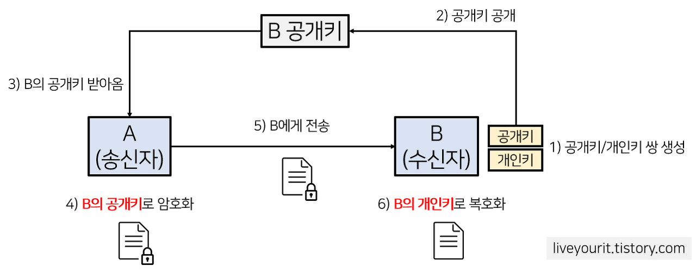

## 공개키 암호화와 대칭키 암호화의 차이가 무엇인가요?

### 공개키 암호화

암복호화에 사용하는 키가 서로 다르며 비대칭키 암호화라고도 불린다.
송수신에 모두 한쌍의 키(개인키, 공개키)를 가진다.
공개키는 모든 사람이 접근 가능한 키이고 개인키는 각 사용자만 가지고 있는 키이다.

1. B (개인키, 공개키) 쌍 생성
2. 공개키 공개, 개인키 본인이 소유
3. A가 B 공개키 받아옴
4. A가 B의 공개키를 사용해 데이터 암호화
5. 암호화된 데이터를 B에게 전송
6. B는 암호화된 데이터를 B의 개인키로 복호화 => 개인키는 B만 가지고 있기에 B만 볼 수 있음

장점 : 키분배 필요가 없다. 기밀성, 인증, 부인방지 기능 제공한다.

단점 : 속도가 느리다.

---

### 대칭키 암호화

암복호화에 사용하는 키가 동일하다.

장점 : 속도가 빠르다.

단점 : 키 배송 문제가 발생한다.
키를 교환하는 중에 키가 탈취될 수 있고 사람이 증가할수록 키 관리가 어려워진다.

키 배송 문제를 해결하기 위한 방법으로는 키의 사전 공유에 의한 해결, 키 배포센터에 의한 해결, 공개키 암호에 의한 해결이 있다.