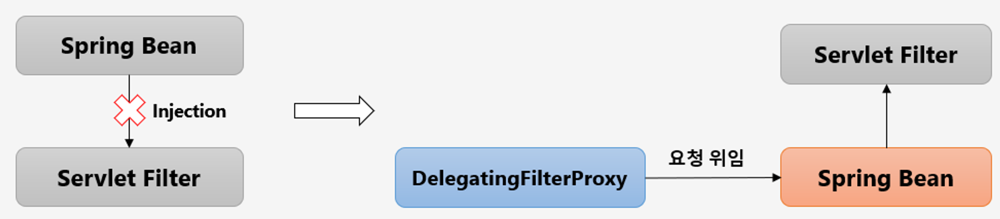

## Flow

기본적으로 spring security는 필터기반으로 작동한다.

하지만 필터는 서블릿 컨테이너 영역이라 스프링 빈을 주입받아 사용할 수 없다.

하지만 **DelegatingFilterProxy**클래스를 사용해 서블릿 필터는 스프링 빈에게 요청을 위임하고 스프링 빈에 구현된 서블릿 필터를 이용해 수행할 수 있다.

> springSecurityFilterChain 이름으로된 빈을 찾아서 요청을 위임한다.

사용자의 요청이 오면 필터를 거치다가 DelegatingFilterProxy에서 springSecurityFilterChain라는 필터를 가지고 있는 빈인 FilterChainProxy에 요청이 위임된다.

FilterChainProxy가 들고있는 springSecurityFilterChain는 한 개가 아니다. 설정에 따라 여러개가 될 수 있다.

다양한 URL 패턴에따라 springSecurityFilterChain이 선택돼 실행된다.

## 인증 절차

사용자가 로그인을 시도하면 usernamePasswordAuthenticationFilter라는 인증필터가 요청정보를 추출해 Authentication을 생성한다.

여기서 usernamePasswordAuthenticationFilter 라는 인증필터가 위에서말한 springSecurityFilterChain중 한개다

AuthenticationManager가 인증절차를 거치고 인증에 실패하면 예외를 던지고, 성공한다면 인증정보를 채워넣는다.

최종적으로 SecurityContext에서 HttpSession으로 저장된다.

## 스레드 로컬

SecurityContextHolder안에 SecurityContext가 있고 그 안에 Authentication 인증객체가 있는다.

SecurityContextHolder는 사용자의 스레드에 공유하지않는 독립적인 공간에 저장된다.

즉 사용자별로 독립적인 인증객체를 가질 수 있다.

SecurityContextHolder안에서 여러 전략을 설정할 수 있는데, 스레드 하나에 하나의 context를 저장하거나, 메인 스레드와 자식스레드가 context를 공유하게할 수 있고 마지막으로 모든 응용프로그램이 하나의 context를 사용할 수 있게 설정가능하다.
